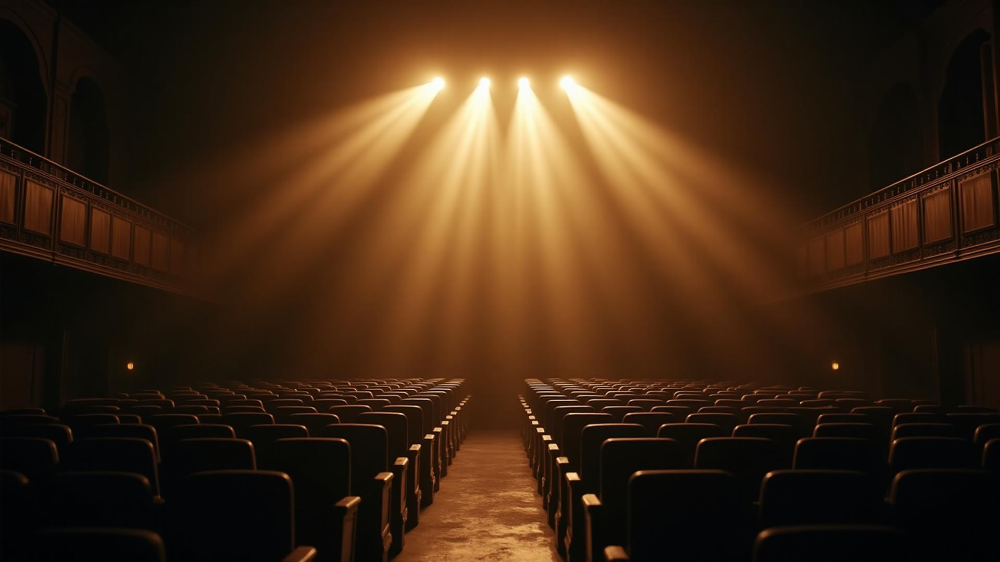

# 🎬 Cinema Hub

Uma aplicação web moderna e elegante para descobrir e gerenciar sua coleção de filmes em exibição.



## ✨ Características

- **🎭 Catálogo de Filmes**: Navegue por uma coleção cuidadosamente selecionada de filmes aclamados
- **📱 Design Responsivo**: Interface adaptativa que funciona perfeitamente em desktop e mobile
- **🎥 Trailers Integrados**: Assista trailers diretamente na aplicação
- **❤️ Lista de Desejos**: Salve seus filmes favoritos para assistir mais tarde
- **🌟 Avaliações**: Visualize avaliações do IMDb e classificações etárias
- **🎨 Interface Moderna**: Design elegante com gradientes dourados e animações suaves

## 🚀 Tecnologias Utilizadas

- **Frontend**: React 18
- **Build Tool**: Vite
- **Estilização**: CSS
- **Roteamento**: React Router DOM
- **Estado**: React Hooks/Zustand + Local Storage
- **Ícones**: Lucide React

## 📦 Instalação

1. **Clone o repositório**
   ```bash
   git clone https://github.com/KaioVeras/CineHub.git
   cd CineHub
   ```

2. **Instale as dependências**
   ```bash
   npm install
   ```

3. **Execute em modo de desenvolvimento**
   ```bash
   npm run dev
   ```

4. **Acesse a aplicação**
   ```
   http://localhost:5173
   ```

## 🛠️ Scripts Disponíveis

- `npm run dev` - Executa a aplicação em modo de desenvolvimento
- `npm run build` - Cria a build de produção
- `npm run preview` - Visualiza a build de produção localmente
- `npm run lint` - Executa o linter para verificar o código

## 🎯 Funcionalidades

### 🏠 Página Principal
- Hero section com call-to-action
- Grid responsivo de filmes em destaque
- Navegação intuitiva

### 🎬 Detalhes do Filme
- Informações completas do filme (sinopse, elenco, diretor)
- Player de trailer integrado
- Opção de adicionar/remover da lista de desejos

### 📋 Lista de Desejos
- Gerenciamento completo da watchlist
- Persistência local dos dados
- Interface para remoção individual ou em lote

## 🎨 Design System

O projeto utiliza um sistema de design consistente baseado em:

- **Cores**: Paleta dourada com tons cinematográficos
- **Tipografia**: Hierarquia clara e legível
- **Componentes**: Biblioteca reutilizável com variações
- **Animações**: Transições suaves e micro-interações

## 📱 Responsividade

- **Mobile**: Design otimizado para dispositivos móveis
- **Tablet**: Adaptação para telas médias
- **Desktop**: Experiência completa para telas grandes

## 📄 Licença

Este projeto está sob a licença MIT. Veja o arquivo [LICENSE](LICENSE) para mais detalhes.

